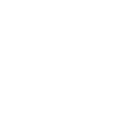

# ttf2cp437

Converts a `.ttf` file into a square [Codepage 437](https://en.wikipedia.org/wiki/Code_page_437) font atlas. Especially handy for converting fonts from [The Oldschool PC Font Resource](https://int10h.org/oldschool-pc-fonts/) to images for use in roguelikes.

## Usage

```
$ ttf2cp437 --help
ttf2cp437 1.0.0
Kenton Hamaluik <kenton@hamaluik.ca>
Converts a `.ttf` file into a square Codepage 437 font atlas.

USAGE:
    ttf2cp437 <FONT> <HEIGHT> [SCALE]

FLAGS:
    -h, --help       Prints help information
    -V, --version    Prints version information

ARGS:
    <FONT>      the path to a .ttf font file to process
    <HEIGHT>    the height (in px) for each glyph
    <SCALE>     an optional real number scale to apply to the resulting glyph set
```

## Example

```
ttf2cp437 Px437_ATI_8x8.ttf 8 2
```

Will open the `Px437_ATI_8x8.ttf` file from [The Oldschool PC Font Resource](https://int10h.org/oldschool-pc-fonts/fontlist/#ati_gfx) and render its glyphs with a height of 8 and a scale of 2. The resulting image will be 256x256 pixels, will be named `Px437_ATI_8x8_2x.png`, and will produce:


